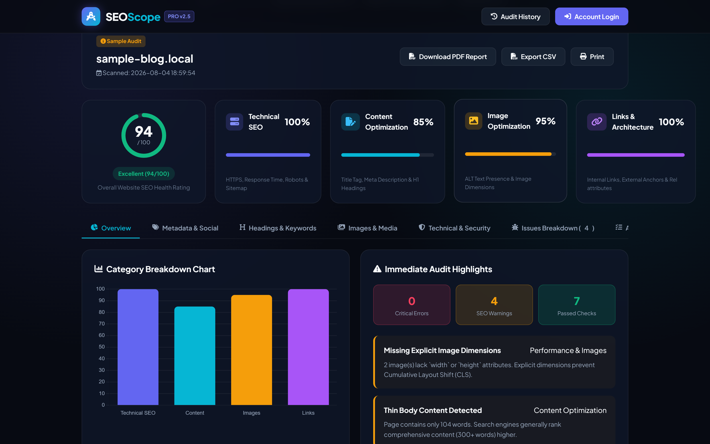

# SEOScope

**Automated Website SEO Audit Engine — self-hostable, zero-config, offline-first.**

Paste any URL, hit *Run SEO Audit*, and in ~2 seconds SEOScope scores your site's
SEO health, ranks the problems by priority, and produces downloadable **PDF** and
**CSV** reports. It ships two built-in demo presets (`sample-blog.local` → 94/100,
`poor-seo-demo.local` → 45/100) so it works with **no internet**.



---

## Highlights

- **6-dimension audit** — Metadata & Social, Headings, Images, Links, Keywords, Technical & Security
- **Overall score 0–100** from a weighted model: Technical ×30% + Content ×30% + Images ×20% + Links ×20%
- **Priority issue list** — Critical / Warning / Passed, filterable by category
- **Actionable recommendations** — each issue comes with a concrete *how-to-fix*
- **Export** — print-ready **PDF** (ReportLab) and **CSV** for spreadsheets
- **Dashboard** — Chart.js category breakdown, live Google SERP snippet preview, audit history
- **Dual-database** — MySQL first, **automatic SQLite fallback** (runs anywhere, no setup)
- **Optional accounts** — session-based auth (scrypt hashing); guests can still scan

## Tech Stack

| Layer | Tech |
|---|---|
| Backend | Python 3 · Flask 3 (pure REST API + Jinja2) |
| Crawler | `requests` + `beautifulsoup4` (offline demo fallback) |
| Scoring | custom weighted algorithm (`score_calculator.py`) |
| Database | MySQL-first with SQLite fallback (`database.py`) |
| Reports | `reportlab` (PDF) · `csv` (CSV) |
| Frontend | vanilla HTML/CSS/JS, dark theme, Chart.js (no React) |

```
Browser (HTML/CSS/JS + Chart.js)
        │ REST API (JSON)
        ▼
Flask 3  ──►  6 analyzers (metadata, headings, images, links, keywords, technical)
        │            │  score_calculator.py  (30/30/20/20 weighted)
        ▼
SQLite / MySQL  ──►  ReportLab PDF  /  CSV export
```

## What it checks

| Analyzer | What it audits |
|---|---|
| **Metadata** | title length (50–60), meta description (150–160), viewport, canonical, robots, charset, Open Graph, Twitter cards |
| **Headings** | H1–H6 counts, single H1 rule, empty/long headings, hierarchy skips |
| **Images** | ALT presence, empty/generic ALT, missing width/height, lazy-load % |
| **Links** | internal/external split, empty/`#`/`javascript:` links, generic anchors, `rel="noopener"` |
| **Keywords** | word count (thin-content), 1/2/3-gram density, keyword stuffing, placement in title/H1/description |
| **Technical** | HTTPS/SSL, response time tiers, document size, `robots.txt`, `sitemap.xml`, mixed content |

## Scoring & Grades

```
overall = Technical*0.30 + Content*0.30 + Images*0.20 + Links*0.20  →  score 0–100
≥ 85 Excellent (#10b981) · ≥ 70 Good (#3b82f6) · ≥ 50 Fair (#f59e0b) · < 50 Needs Improvement (#ef4444)
```

Every check is auto-tagged **Critical / Warning / Passed** and folded into a
priority-ranked recommendation list (High / Medium / Low), so fixing item #1 moves
the score deterministically.

## Run Locally

```bash
pip install -r requirements.txt
python app.py                # → http://127.0.0.1:5000
```

> No MySQL required — if MySQL isn't reachable the app logs `Falling back to SQLite`
> and uses `seoscope.db` automatically.

### Environment Variables (all optional)

| Variable | Default | Purpose |
|---|---|---|
| `SECRET_KEY` | built-in fallback | Flask session signing key |
| `PORT` | `5000` | HTTP listen port |
| `MYSQL_HOST / MYSQL_USER / MYSQL_PASSWORD / MYSQL_DB / MYSQL_PORT` | `localhost/root/…/seoscope_db/3306` | MySQL connection (used only if available) |

## Authentication (optional)

Register / log in from the Account menu. Passwords are hashed with Werkzeug
(`generate_password_hash`), stored server-side in a signed Flask session. Logged-in
users see only their own audit history; guests can still run scans.

## Reports

Every scan is persisted with its full JSON `audit_data`, so any past report can be
re-exported on demand:

- **PDF** → `GET /api/reports/<id>/pdf` (ReportLab, charts + issue tables)
- **CSV**  → `GET /api/reports/<id>/csv` (spreadsheet-friendly)
- History at `GET /api/reports`, detail at `GET /api/reports/<id>`.

## Verified Green

```bash
python -m unittest test_seoscope        # 5/5
# test_01_database_init        ok
# test_02_seo_audit_engine     ok   (sample-blog.local → 94)
# test_03_poor_seo_audit_engineok   (poor-seo-demo.local → 45)
# test_04_pdf_csv_generation   ok   (ReportLab PDF + CSV)
# test_05_flask_api_scan       ok   (/api/scan → /api/reports/<id>/pdf)
```

## Deploy (Render / Railway)

The README in `DEPLOY_RAILWAY.md`-style steps applies (Flask on any Python host):
install `requirements.txt`, run `python app.py`, set `PORT`. SQLite means it runs
anywhere with zero dependencies. (For SeoScope the DB is SQLite-first by default,
so free-tier deploys keep their data unless `data/` is wiped.)

## Demo Assets

A premium presentation deck, annotated screenshots, a demo video, and a
self-contained Claude presentation prompt live in [`demo_assets/`](demo_assets/).
Open `demo_assets/SEOScope_Presentation.pptx` for the slide deck, or watch
`demo_assets/video/seoscope-demo.mp4` for a full 28-second walkthrough.

## License

MIT
